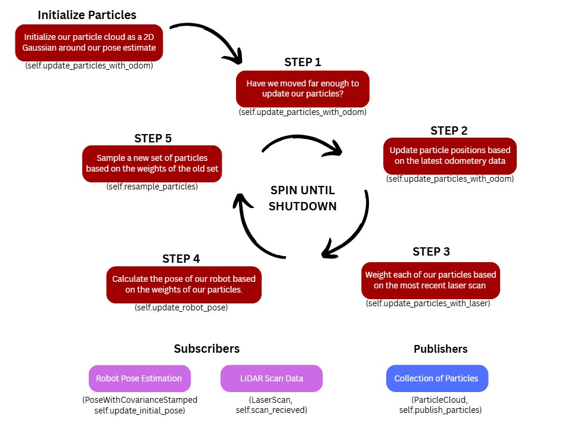
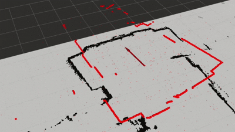

Our writeup should address the following questions:   
1. What was the goal of your project?
2. How did you solve the problem? (Note: this doesn’t have to be super-detailed, you should try to explain what you did at a high-level so that others in the class could reasonably understand what you did).
3. Describe a design decision you had to make when working on your project and what you ultimately did (and why)? These design decisions could be particular choices for how you implemented some part of an algorithm or perhaps a decision regarding which of two external packages to use in your project.
4. What if any challenges did you face along the way?
5. What would you do to improve your project if you had more time?
6. Did you learn any interesting lessons for future robotic programming projects? These could relate to working on robotics projects in teams, working on more open-ended (and longer term) problems, or any other relevant topic.

# WRITE-UP DRAFT BELOW
# Robot Localization Project 
### Sam Wisnoski, Satchel Schiavo

## Project Goals:      
### Introduction:  
Our project goal was for a robot to be able to identify it's location and orientation given data from some LiDAR scans and a map of it's world frame. We used a particle filter to generate particles with a given pose and could then evaluate them to help create new particles until they converged onto a localization which represented our best pose estimate. We did this by mapping the closest LiDAR scans to each particle and comparing the scans to the map, and repopulated using a mix of kept 'high fitness' particles, a Gaussian distribution of particles centered around based off those same kept particles, and new, random particles, all of which were then given some random 'noise' or slight variation, and normalized. Our final filter could converge fairly quickly and would consistantly match the location of the Neato, and would not fall into local minimums.

Two examples of our particle filter working can be found here: 
* Path One: https://www.youtube.com/watch?v=UJY09rE9wLA
* Path Two: https://www.youtube.com/watch?v=vSg7XNA64JA

### Individual Learning Goals:   

#### Satchel's learning goals: 
My main learning goals for learning in depth how the Particle Filter math worked, diagnosing errors in the filter and understanding how playing with terms in our equation impacted both the accuracy of our converged localization as well as create bugs, and finally as a stretch learning goal understand and attempt to implement the Kalman filter. The first two were derived from mostly being interested in how different algorithms/ numerical methods are used in robotics and as it built nicely upon previoulsy projects I had done. I spent a lot of time working onthe pseudocode of the filter, and divided work with Sam to write the code for the evaluation and robot localization functions. My final learning goal of working with the Kalman filter after the lecture in class because it seemed like a real world extension of the particle filter. This proved difficult to implement but I spent a lot of time looking at papers and understanding the math behind it.

#### Sam's learning goals:
For this project, I wanted to focus on two main goals: 1) understanding a particle filter mathematically; and 2) implimenting code/functions in a new & unfamiliar codebase. The first goal was directly achieved in the early stages of the 
project as Satchel and I worked together to understand the various components of the particle filter. Before we even touched the code, we sat down and went function by function to gain a full understanding of how our filter worked. My second goal was a bit harder to reach; although we did impliment functions in the existing skeleton code, I felt it wasn't pretty. As we wrote each function, I had to constantly read through the helper functions, trying to use them as my guide to what angle we should approach our own implementation from. In the end, I ended up going through and commenting through the entire codebase in order to truly understand what was happening programatically. It was only after this that I felt I truly reached my second goal. Also, as Satchel mentioned, we shared work evenly across the project, from implementation, to testing, to write-up. 

## Methodology Overview:   
Explain methodology. Want to provide a lot of diagrams, gifs, videos etc here
Basically go through the main loop and describe what happens to our particles as we drive around (initialization, updating, weighting, pose estimation, redistributing) 
Overview the algorithms/equations. 

Main loop: 

#### Step 1:   

#### Step 2: 

#### Step 3: 

#### Step 4: 

#### Step 5: 

### Final Result:   

## Design Decisions:   

### Particle Resampling
One of our design decisions was in our resampling function. We split all new particles into three distinct groups - first 60% are 'kept' particles, or randomly chosen from the previously iteration of particles, with higher weighted particles being more likely to be chosen. We chose to implement this instead of simply keeping the 60% highest weighted particles to ensure some randomness in the localization - keeping the exact same 60% would be susceptiple to local minimums, where a particle could fall into a pose far closer to being correct than any of the surrounding poses, and would remain there throughout multiple iterations. To aid this, another 30% of resampled particles are completely random - this was done to help particles escape the local minumum, but also speed up exploration of far-off map areas. The final 10% were found from a Gaussian distribution of the kept particles, which conceptually works as a middle ground between the other two groups. We begin by determing a subsection of our kept particles, then randomly picking a point inside a radius centered around each kept particle. This helps the particle explore multiple close guesses, espieically prevneting it from getting trapped in areas with lots of local minimums, which will naturally increase as it converges closer and closer to the actual map space.

### Weighting Function

## Challenges:   
We had many small challenges for this project, (syntax, formatting, variable types, typos, etc), but the two big challenges are mirrored in our design decisions. First, we spent a lot of testing our resampling function to see what worked best. We had started out with just keeping some particles EXACTLY as they were (no noise) and resampling just based on gaussian, but Satchel quickly realized this design was prone to local minima. We then decided to add a large sampling of randomized particles to help with this problem, as well as add noise to every particle each time we resampled.

Our second major challenge was finding a good weighting function. Initially, we used an inverse function (1/x) to calculate weights, meaning that higher error values resulted in higher weights—exactly the opposite of what we wanted. We also summed the error based on the number of valid scans, which unintentionally gave LiDAR data with fewer scans higher weights. In reality, we wanted particles with more valid scan information to receive higher weights.
We resolved both issues by redefining our weighting function using an exponential Gaussian model: `particle.w = (math.exp(- (error_sum / count) / 0.5))**2`. This change made our particle filter perform nearly perfectly, converging correctly in every run.

## Potential Improvements:   
As a stretch goal for this project, we wanted to implement the Kalman filter and test the difference between the two. Would one converge faster, would it be more prone to errors? In the end, we found implementing a homemade Kalman filter to be too tricky, but would love to try again if given more time for the project. We would also want to improve convergence as the robot is turning, as we have the found the most errors with this, although this is likley due to a lack of data points.

## Conclusion:  
#### How It Went: 
TBD. 

#### Lessons Learned:   
TBD. 
